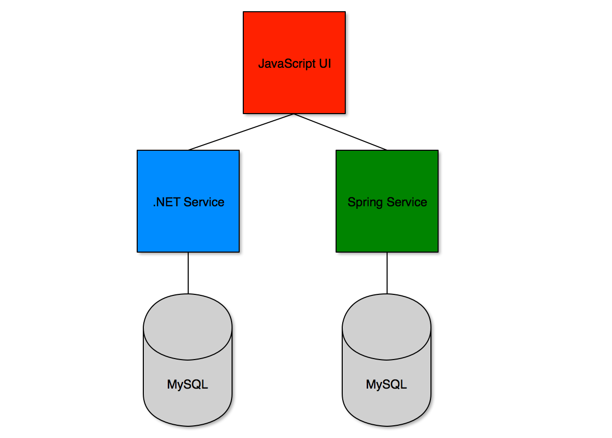

# DevOps Days Vancouver

Pivotal Cloud Foundry (PCF) is a platform that runs on top of an IAAS layer that simplifies developer and operator workflows enabling a true DevOps culture to emerge.

## Architecture

The following is the application that will be deployed. It is a polyglot architecture utilizing .NET, Spring (Java) and Javascript. All applications are running in PCF.

## Environment and Prerequisites

This needs to run on an installation of Pivotal Cloud Foundry with Diego Windows installed:

https://docs.pivotal.io/pivotalcf/opsguide/deploying-diego.html

The CF CLI also needs to be installed on the development machine to push the applications from:

https://docs.cloudfoundry.org/cf-cli/install-go-cli.html

## Authentication

## Deployment

## Logs

